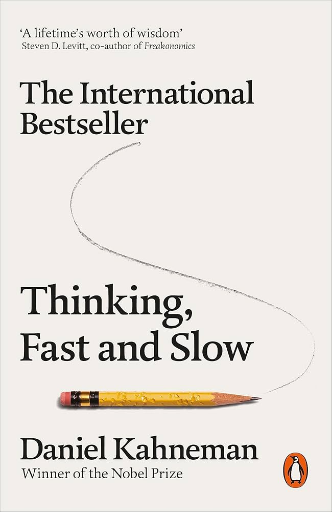
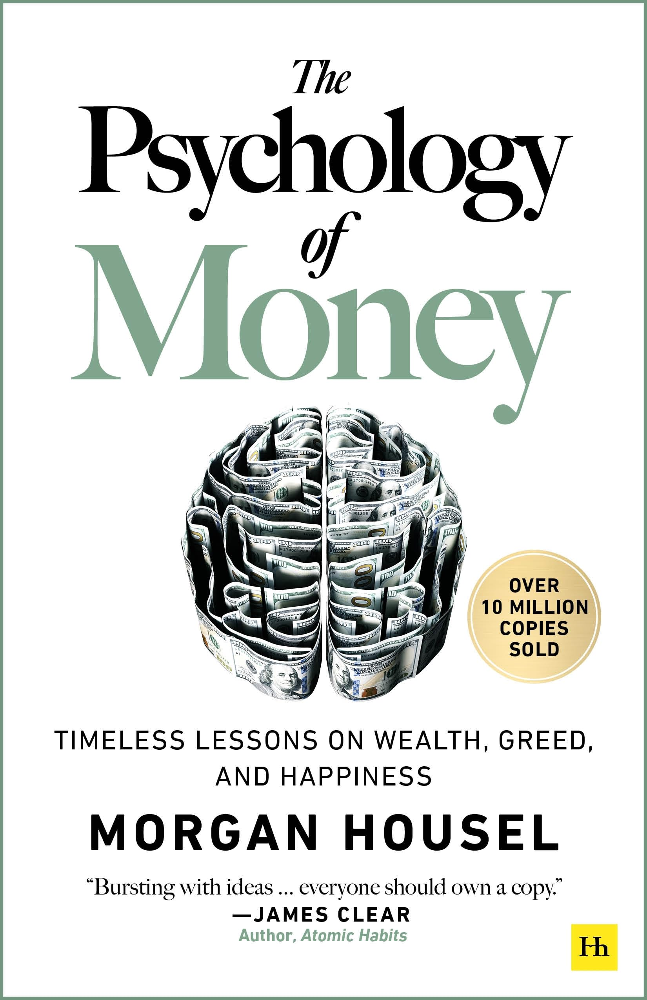
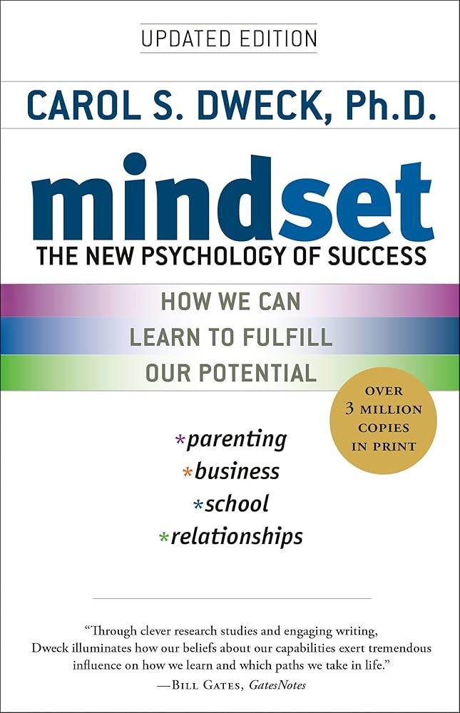
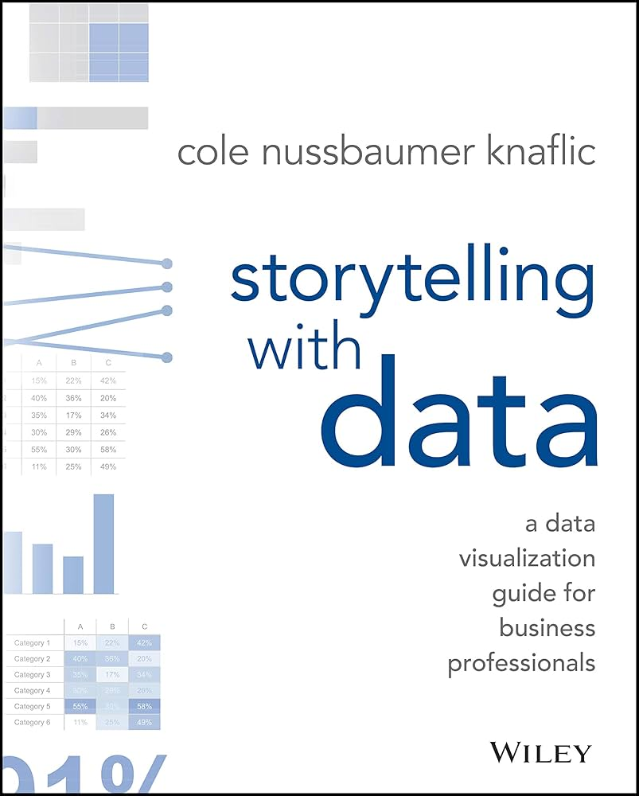
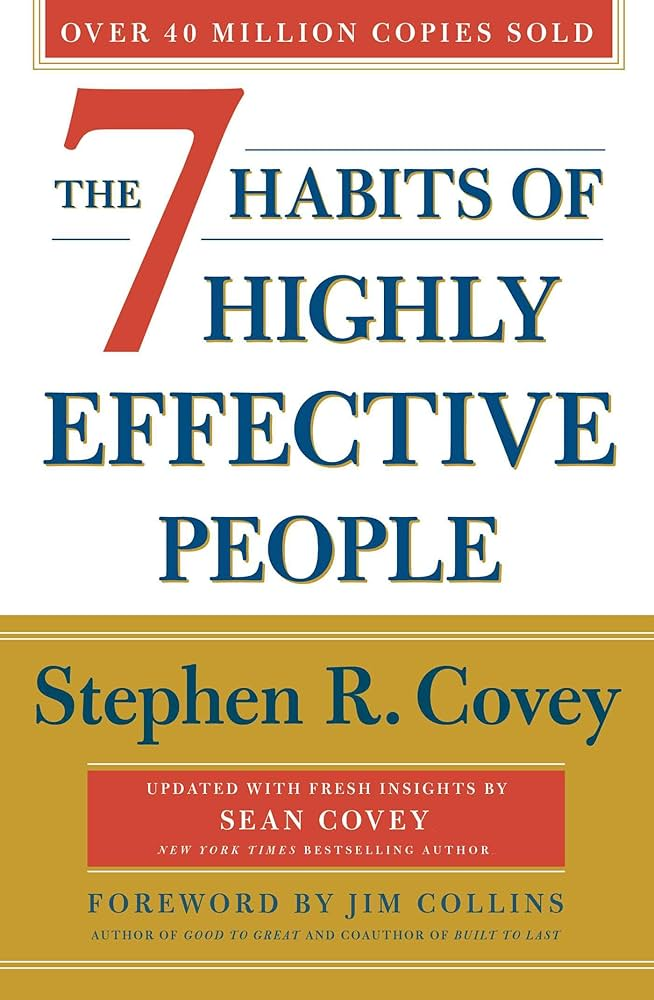
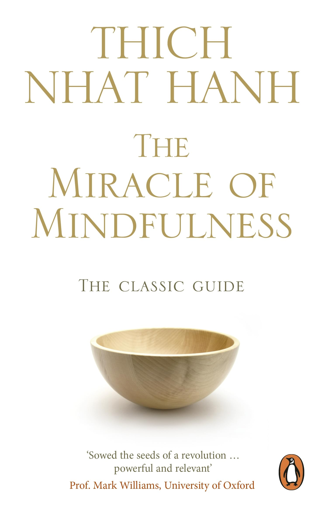
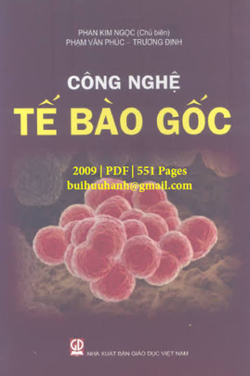
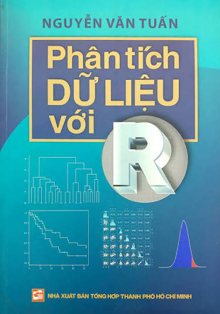

## Trieu Le

I am a researcher with interests in microbial genomics, 
antimicrobial resistance and bacterial evolution.

My research interests include:

- Microbial genomics
- Plasmid evolution
- Antimicrobial resistance
- Application of genomics and bioinformatics to clinical challenges

---

## Profile

I am a researcher with research interests in **infectious diseases,
antimicrobial resistance, microbial genomics, bacterial population genomics,
and mobile genetic elements**.

My current research focuses on using genomic and computational approaches to
understand mobile genetic elements and bacterial evolution.

---

## Education

### PhD in Life Sciences
**University of Bath, United Kingdom**  
2024–2028

Research focus: microbial genomics, bacterial evolution, pangenomics, and mobile genetic elements.

Supervised by:

**Professor Zamin Iqbal** [link](https://researchportal.bath.ac.uk/en/persons/zamin-iqbal/)

**Dr. Lauren Cowley** [link](https://researchportal.bath.ac.uk/en/persons/lauren-cowley/)

---

### MPhil in Genomic Medicine
**University of Cambridge / Wellcome Sanger Institute, United Kingdom**  
2023–2024

Research focus: microbial genomics and mobile genetic elements in *Mycobacteria abscessus*.

Supervised by:

**Dr. Josie Bryant** [link](https://www.sanger.ac.uk/person/bryant-josie/)

**Professor Timothy M. Walker** [link](https://www.oucru.org/people/timothy-walker/)

---

### BSc in Biology and Biotechnology
**University of Science, Vietnam National University Ho Chi Minh City, Vietnam**  
2014–2018

Research focus: Biotechnology, Stem cell biology and liver disesase.

Supervised by:

**Dr. Truong Hai Nhung** [link](https://scholar.google.com/citations?user=KGDqia4AAAAJ&hl=en)

**Dr. Le Van Trinh** [link](https://www.researchgate.net/profile/Trinh-Le-Van)

---

## Research Experience

### PhD Researcher
**University of Bath**  
2024–Present

Research in bacterial population genomics, antimicrobial resistance, plasmids,
mobile genetic elements, and bacterial evolution.

Current methodological interests include:

- Long-read bacterial genomics
- Pangenomics
- Plasmid genomics
- Phylogenetics
- Population genomics
- Mobile genetic elements
- Bioinformatics algorithm development and application

---

### MPhil Student
**Wellcome Sanger Institute / University of Cambridge**  
2023–2024

Training and research in genomic science and bioinformatics, with a focus on
microbial genomics.

---

### Research Assistant — Tuberculosis Research Group
**Oxford University Clinical Research Unit, Vietnam**  
2018–2023

Supervised by:

**Professor Nguyen Thuy Thuong Thuong** [link](https://www.oucru.org/people/nguyen-thuy-thuong-thuong/)

**Dr. Trinh Thi Bich Tram** [link](https://www.oucru.org/people/trinh-thi-bich-tram/)

**Ms Do Dang Anh Thu** [link](https://www.oucru.org/people/do-dang-anh-thu/)

Research focused on *Mycobacterium tuberculosis*, tuberculosis diagnostics,
antimicrobial resistance, and genomic approaches to infectious diseases.

Research activities included:

- Tuberculosis microbiology
- Drug-resistance research
- Molecular and genomic diagnostics
- Clinical research
- Bacterial genomics

---

## Research Interests

- Microbial genomics
- Antimicrobial resistance
- Bacterial evolution
- Plasmids and mobile genetic elements
- Bioinformatics

---

## Selected Publications

### Phylogenetic distribution and longitudinal persistence of plasmids in *Mycobacterium abscessus*

**Trieu Le**, Josephine M. Bryant  
*Microbial Genomics*, 2026.  
[DOI](https://doi.org/10.1099/mgen.0.001807)

### Amira: detection of AMR genes directly from long reads using gene-space de Bruijn graphs

Daniel Anderson, Leandro Lima, **Trieu Le**, Louise Judd, Ryan Wick, Zamin Iqbal  
Preprint, 2025.  
[DOI](https://doi.org/10.1101/2025.05.16.654303)

### Infection by Clonally Related *Mycobacterium abscessus* Isolates: The Role of Drinking Water

Rachel Thomson, N. Wheeler, R. E. Stockwell, J. Bryant, S. L. Taylor, 
L. E. X. Leong, **T. Le**, G. B. Rogers, R. Carter, L. J. Sherrard, et al.  
*American Journal of Respiratory and Critical Care Medicine*, 2025.
*American Journal of Respiratory and Critical Care Medicine*, 2025.  
[DOI](https://doi.org/10.1164/rccm.202409-1824oc)

### Targeted sequencing from cerebrospinal fluid for rapid identification of drug-resistant tuberculous meningitis

Trinh Thi Bich Tram, **Le Pham Tien Trieu**, Le Thanh Hoang Nhat, 
Do Dang Anh Thu, Nguyen Le Quang, Nguyen Duc Bang, Tran Thi Hong Chau, 
Guy E. Thwaites, Timothy M. Walker, Vu Thi Ngoc Ha, et al.  
*Journal of Clinical Microbiology*, 2024.

[DOI](https://doi.org/10.1128/jcm.01287-23)

---

## Technical Skills

### Genomics & Bioinformatics

- Short- and long-read bacterial genome sequencing analysis
- De novo genome assembly and genome quality assessment
- Bacterial pangenome and comparative genomic analysis
- Phylogenetic reconstruction and evolutionary analysis
- Population genomics and bacterial population structure
- Plasmid identification, typing, and structural comparative analysis
- Antimicrobial resistance gene and resistance-associated mutation detection
- Identification and genomic characterisation of mobile genetic elements

### Computational

- R
- Command-line bioinformatics
- Linux / Unix
- Git and GitHub
- Reproducible genomic workflows

### Laboratory & Research

- Bacterial culture
- *Mycobacterium tuberculosis* research
- BSL-3 laboratory work
- Molecular microbiology
- Clinical research
- Good Clinical Laboratory Practice (GCLP)
- Good Clinical Practice (GCP)

### Other activities

- **Sustainability and environmental engagement:** contributing to the University of Bath Green Impact initiative to promote sustainable practices in research and everyday academic life
- **Science communication and public engagement:** scientific writing, blogging, and outreach, including Pint of Science
- **Teaching:** teaching assistant in bioinformatics and genomics
- **Practical teaching and assessment:** demonstrating and marking in microbiology and molecular biology practicals, cancer biology, and genomics

---

## Academic Service

### Peer Review

Reviewer for:

- *Nature Communications*
- *Microbial Genomics*

---

## Research Profiles

[ORCID](https://orcid.org/0009-0000-2555-0496) ·
[GitHub](https://github.com/Trieu-Le1211)
- Microbial genomics
- Bacterial population genomics
- Plasmids and mobile genetic elements
- Bioinformatics

---

## Books That Shaped My Thinking

These books  have influenced how I think about
science, learning, decision-making, communication, money, and life.

::: {.book-entry}

:::: {.columns}

::: {.column width="22%"}

:::

::: {.column width="78%"}

### Thinking, Fast and Slow

*Daniel Kahneman*

This book made me more aware of how intuition, cognitive biases, and
uncertainty influence our decisions. The distinction between fast,
intuitive thinking and slower, deliberate reasoning has stayed with me,
particularly when I think about scientific evidence and decision-making.

:::

::::

:::

---

::: {.book-entry}

:::: {.columns}

::: {.column width="22%"}

:::

::: {.column width="78%"}

### The Psychology of Money

*Morgan Housel*

This book gave me a different perspective on how people make financial decisions and how strongly those decisions are shaped by behaviour, experience, and personal circumstances. It encouraged me to reflect on my own relationship with money and motivated me to build a more thoughtful, disciplined, and sustainable financial plan for the future.

:::

::::

:::

---

::: {.book-entry}

:::: {.columns}

::: {.column width="22%"}

:::

::: {.column width="78%"}

### Mindset

*Carol S. Dweck*

This book changed how I think about ability and failure. It influenced how I approach learning, research, and new challenges, encouraging me to focus more on progress and improvement rather than being afraid of making mistakes.

:::

::::

:::

---

::: {.book-entry}

:::: {.columns}

::: {.column width="22%"}

:::

::: {.column width="78%"}

### Storytelling with Data

*Cole Nussbaumer Knaflic*

This book changed how I think about presenting scientific results. I learned that a good figure is not simply one that displays the data accurately; it should also help the audience quickly understand the main message.

:::

::::

:::

---

::: {.book-entry}

:::: {.columns}

::: {.column width="22%"}

:::

::: {.column width="78%"}

### The 7 Habits of Highly Effective People

*Stephen R. Covey*

This book made me think more deliberately about how I organise my life and use my time. In particular, the ideas of beginning with the end in mind and putting first things first helped me connect everyday decisions with longer-term goals. It also reminded me that effectiveness is not simply about being productive, but about building good relationships, maintaining balance, and continuously investing in personal growth.

:::

::::

:::

---

::: {.book-entry}

:::: {.columns}

::: {.column width="22%"}

:::

::: {.column width="78%"}

### The Miracle of Mindfulness

*Thich Nhat Hanh*

This book introduced me to Buddhism not only as a religion, but also as a philosophy for understanding the mind, suffering, happiness, and our relationship with the world around us. Thich Nhat Hanh’s approach to mindfulness taught me to pay more attention to the present moment rather than constantly thinking about what comes next.

:::

::::

:::

---

::: {.book-entry}

:::: {.columns}

::: {.column width="22%"}

:::

::: {.column width="78%"}

### Tế Bào Gốc (in Vietnamese)

*Phan Kim Ngoc*

This was the first scientific book I ever owned, a gift from my sister when I turned 17. It sparked my curiosity about stem cells and motivated me to join a stem cell research laboratory later, where I learned the fundamentals of scientific research and gained my first experience at the lab bench. It also encouraged me to think beyond experiments themselves—to consider how discoveries in the laboratory can be translated into biotechnology and real-world applications. Looking back, this book represents where my academic journey began and helped shape the way I think about science: from understanding fundamental biology to asking how that knowledge can ultimately be applied.

:::

::::

:::

---

::: {.book-entry}

:::: {.columns}

::: {.column width="22%"}

:::

::: {.column width="78%"}

### How to analyze data with R (in Vietnamese)

*Nguyen Van Tuan*

Before reading this book, I was almost entirely a wet-lab researcher and felt somewhat intimidated by coding and data analysis. This book helped me understand the logic behind data analysis and made R feel approachable rather than something to avoid. More importantly, it gave me the confidence and motivation to start learning independently and take greater ownership of my data. That small beginning eventually changed the direction of my research journey—today, I use R, coding, and computational tools almost every day.

:::

::::

:::

