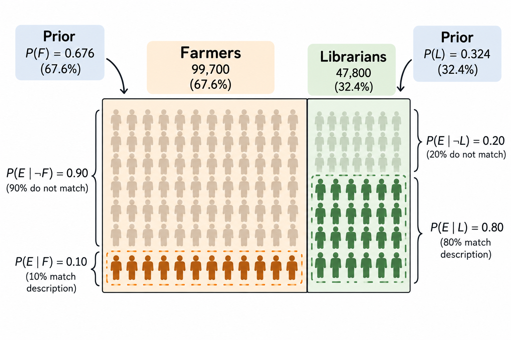

[← Back to Bioinformatics for "Dum me"](index.qmd)

**Why am I learning this?**

Bayesian statistics appears frequently in bioinformatics, from phylogenetic
inference to genomic epidemiology.

As someone whose background is in biology, I have often found the terms confusing and intimidating. 

So, let change that.

## 1. Is it a crocodile or a aligator? 🐊

Imagine you are blindfolded and asked to identify an animal. You somehow safely touch it and feel its rough skin. You are told that it is either a crocodile or an alligator.

*These two animals are very similar, but they have some differences. For example, crocodiles generally have a V-shaped snout, while alligators have a broader, U-shaped snout.*

Right now, with the limited information you have, you are not sure whether it is a crocodile or an alligator. You can only make a guess. For simplicity, you assume that they are equally likely.

**What is a prior?**

In Bayesian statistics, a prior represents our initial belief about the probability of something before observing new evidence.

In the crocodile vs. alligator example, our prior belief is that either animal is equally likely because we do not yet have enough information to favour one over the other.

As we gather more evidence, we can update our prior belief to form a posterior—our updated belief after taking the new evidence into account.

**Additional information**

You realise that you are standing in the United States, where alligators are much more common than crocodiles (*with ratio 2500:1*). Now you are leaning towards the animal being an alligator. You can update your initial belief based on this new information.

But then your friend tells you that the animal was captured from the **Nile River** in Africa and brought to the United States. *Nile crocodiles inhabit freshwater rivers, lakes, and marshes across sub-Saharan Africa, including parts of the Nile River.*
Now you are leaning towards the animal being a crocodile. Once again, you update your belief based on the latest information. If you followed that reasoning, then you have just used Bayesian inference in action.

You started with a prior belief, gathered new evidence, and updated your belief to form a posterior belief. As more evidence becomes available, you can continue updating what you believe.

## 2. Who is Bayes?

Thomas Bayes (c. 1701–1761) was an English mathematician, statistician, and Presbyterian minister. He is best known for Bayes’ theorem, which describes how probabilities can be updated when new evidence becomes available. His work was published posthumously in 1763 and later became the foundation of Bayesian statistics. Today, Bayesian methods are widely used in medicine, genetics, bioinformatics, machine learning, and many other scientific fields.

**FACT: His famous theorem was published after he died. His friend Richard Price found and edited Bayes’ unpublished work, which appeared in 1763.**

## 3. Farmer or Librarian?

You and your friend are on a train from Bath to London. You notice a skinny man wearing glasses and reading a book. Your friend knows him personally and asks you to guess:

***Is he a farmer or a librarian?***

Based on his appearance, many people might immediately guess that he is a librarian.

However, **Daniel Kahneman**, winner of the 2002 Nobel Memorial Prize in Economic Sciences, famously discussed how people often neglect base rates when making judgments like this.

Suppose there are approximately 99,700 farmers and 47,800 librarians in the UK (UK government statistics, 2026). Before considering anything about the man’s appearance, randomly selecting a farmer would therefore be more likely than selecting a librarian.

This gives us our prior probability. But the base rate alone is **not enough**.

We also need to ask:

*How likely would we be to see a skinny man wearing glasses and reading a book if he were a farmer, compared with if he were a librarian?*

This is the likelihood.

For illustration, suppose:

* 10% of farmers fit this description.
* 80% of librarians fit this description.

*Note: These percentages are made-up data used only to illustrate Bayesian inference.*

{fig-align="center" width="90%"}

## 4. The boring formula of probability

Applying Bayes’ Theorem

Now let’s use our numbers to calculate the probability that the man is a librarian.

We have:

* Farmers: 99,700
* Librarians: 47,800
* 10% of farmers fit the description
* 80% of librarians fit the description

Let:

* $L$ = the man is a librarian
* $F$ = the man is a farmer
* $E$ = the man is skinny, wears glasses, and is reading a book

Step 1: Calculate the prior probabilities

Before looking at the man, the probability that a randomly selected person from these two groups is a librarian is:

$$
P(L) = \frac{47,800}{47,800 + 99,700}
= 0.324
$$

So our prior probability of librarian is about 32.4%.

Similarly:

$$
P(F) = \frac{99,700}{47,800 + 99,700}
= 0.676
$$

The prior probability of farmer is therefore 67.6%.

So, before seeing any other information, farmer is more likely.

⸻

Step 2: Add the likelihood

We assumed that:

$$
P(E \mid L) = 0.80
$$

meaning that 80% of librarians fit our description.

For farmers:

$$
P(E \mid F) = 0.10
$$

meaning that 10% of farmers fit the description.

Now we have both the prior and the likelihood.

⸻

Step 3: Apply Bayes’ theorem

We want to calculate:

$$
P(L \mid E)
$$

which means:

What is the probability that the man is a librarian given that we observed this evidence?

Bayes’ theorem gives us:

$$
P(L \mid E)
=
\frac{P(E \mid L)P(L)}
{P(E \mid L)P(L) + P(E \mid F)P(F)}
$$

Substituting our numbers:

$$
P(L \mid E)
=
\frac{0.80 \times 0.324}
{(0.80 \times 0.324) + (0.10 \times 0.676)}
$$

$$
\frac{0.2592}
{0.2592 + 0.0676}
=
0.793
$$

Therefore:

$$
\boxed{P(L \mid E) \approx 79.3\%}
$$

The posterior probability that the man is a farmer is:

$$
P(F \mid E) = 1 - 0.793 = 0.207
$$

or approximately 20.7%.

What happened?

Before observing the man:

Farmer: 67.6%; Librarian: 32.4%

After observing the evidence:

**Farmer: 20.7; Librarian: 79.3%**

The population numbers initially favour farmer. However, our hypothetical evidence is much more likely among librarians than farmers:

$$
\frac{P(E \mid L)}{P(E \mid F)}
=
\frac{0.80}{0.10}
=
8
$$

In other words, this particular observation is **8 times** more likely if the man is a librarian than if he is a farmer.

That evidence is strong enough to overcome the initial base-rate advantage of farmers.

This demonstrates the key idea of Bayesian inference:

Start with a prior belief → observe evidence → update to a posterior belief.

The prior tells us what was plausible before seeing the evidence.
The likelihood tells us how compatible the evidence is with each hypothesis.
The posterior tells us what we should believe after combining both.

## 5. The perfect example of Bayes' theorem: POKER 🃏

**Poker** to me is a perfect example of Bayesian thinking because you constantly update your beliefs with incomplete information.

Imagine you are playing Texas Hold’em. You cannot see your opponent’s cards, but based on their position, previous behaviour, and possible starting hands, you already have an initial idea of what they might hold. This is your prior.

Your opponent suddenly makes a large raise. This is new evidence.

You now ask: How likely are they to make this raise with a strong hand? How likely are they to do it with a weak hand or a bluff? This is the likelihood.

You combine the prior with this evidence and update your belief about their hand. This updated belief is the posterior.

Then another card appears, your opponent bets again, and you update again:

**Prior → Evidence → Posterior → New evidence → New posterior**

In poker, as in Bayesian inference, the key question is:

Given what I already know, how much should this new information change what I believe?

## 6. Bayes' theorem in Medicine 🩺

Bayesian thinking is everywhere in medicine, particularly in diagnosis. Clinicians constantly start with an initial probability of disease, gather new evidence, and update that probability.

**Diagnostic tests**

*A patient has a positive HIV test. Does this mean they definitely have HIV?*

Not necessarily.

Before testing, the patient has a pre-test probability of HIV based on factors such as prevalence and clinical context. The test result provides new evidence. Its sensitivity and specificity tell us how likely that result is in people with and without HIV.

We then update our probability:

**Pre-test probability → Test result → Post-test probability**

In Bayesian terms:

**Prior → Evidence → Posterior**

⸻

**Pulmonary embolism**

A patient presents with shortness of breath and chest pain.

Based on the history, examination, and a clinical prediction rule such as the Wells score, you estimate the probability of pulmonary embolism (PE).

This is your prior.

You perform a D-dimer test. A negative result provides new evidence and may substantially reduce the probability of PE.

The probability after considering the D-dimer is your posterior.

This explains an important principle in medicine:

The same test result can mean different things in patients with different pre-test probabilities.

⸻

**Meningitis**

A patient presents with fever, headache, and neck stiffness.

Initially, you consider several diagnoses, including bacterial meningitis, viral meningitis, and encephalitis. Your clinical assessment gives each diagnosis an initial probability.

You then perform a lumbar puncture.

The CSF shows:

* Neutrophilic pleocytosis
* Low glucose
* High protein

These findings are more compatible with bacterial meningitis, so you update your belief and assign a higher probability to that diagnosis.

Again:

**Clinical suspicion → New evidence → Updated probability**

⸻

**Sequential Bayesian updating**

In real clinical practice, we rarely receive all the information at once.

Instead, evidence arrives sequentially:

History → Examination → Blood tests → Imaging → Microbiology → Treatment response

After each new piece of information, we update our assessment.

The posterior from one step becomes the prior for the next.

This is Bayesian inference in everyday clinical medicine.

::: {.callout-tip}

Clinical translation of Bayes’ theorem

Prior = What did I think before the test?

Likelihood = How compatible is this result with the disease?

Posterior = What do I think after the test?

Or, in familiar clinical language:

Pre-test probability → Diagnostic test → Post-test probability
:::

## 7. Bayes' theorem in Bioinformatics 🧬

Bayesian inference is widely used in bioinformatics because biological data are often incomplete, noisy, and uncertain.

The basic idea remains the same:

Prior knowledge + Biological data → Updated probability

**Phylogenetics 🌳**

Suppose we have DNA sequences from several bacterial isolates and want to reconstruct their evolutionary history.

There are many possible phylogenetic trees.

Before examining the sequence data, our evolutionary model gives us some expectation about which trees and parameters are plausible. This represents our prior.

We then ask:

How likely are the observed DNA sequences if a particular tree and evolutionary model are correct?

This is the likelihood.

Combining the prior and likelihood gives us the posterior probability of different trees and evolutionary parameters.

Prior evolutionary assumptions → Sequence data → Posterior distribution of trees

This is the principle behind Bayesian phylogenetic programs such as BEAST and MrBayes.

⸻

**Molecular dating ⏳**

Bayesian inference can also be used to estimate when evolutionary events occurred.

Suppose we have bacterial genomes collected at different dates.

We may have prior assumptions about the evolutionary rate. The observed genetic differences between isolates and their sampling dates provide the data.

Bayesian inference combines these to estimate posterior distributions for:

* evolutionary rate
* dates of ancestral nodes
* time to the most recent common ancestor (tMRCA)

Instead of simply saying:

“This ancestor existed in 1900.”

we might estimate:

“The most probable date is around 1900, with a credible interval representing our uncertainty.”

Tools such as BEAST and BactDating use Bayesian approaches for molecular dating.

⸻

**Variant calling 🧬**

Imagine sequencing a position in a genome where some reads contain A and others contain G.

Is this a real genetic variant or simply sequencing error?

A Bayesian variant caller can combine:

Prior probability of a variant + observed sequencing reads → Posterior probability of a variant

Read depth, base quality, sequencing error rates, and other information can contribute to the likelihood.

The result is a probability that a particular genotype or variant is actually present.

⸻

**The common pattern**

Although the biological questions are very different, the Bayesian logic is the same:

Application	Prior	Evidence	Posterior
Phylogenetics	Evolutionary assumptions	DNA sequences	Probable trees
Molecular dating	Clock/model assumptions	Sequences + sampling dates	Ancestral dates and rates
Variant calling	Expected variant/genotype probabilities	Sequencing reads	Variant/genotype probabilities

So whether we are diagnosing a patient, playing poker, or reconstructing bacterial evolution, the underlying question is the same:

Given what I believed before, how should these new data change what I believe?

## 8. BactDating: Bayesian Inference in Action 🦠⏳

BactDating is a tool used to estimate the timescale of bacterial evolution.

Imagine you have 500 E. coli genomes collected between 2000 and 2025. You have already reconstructed a phylogenetic tree from their genomic sequences. The tree tells you which isolates are related, but its branch lengths mainly represent genetic change, not calendar time.

What you want to know is:

When did their common ancestors exist?

For example, when did a particular lineage emerge? When did two bacterial populations diverge? When did the most recent common ancestor (MRCA) exist?

This is where BactDating uses Bayesian inference.

**What goes into BactDating?**

BactDating combines several sources of information:

* a bacterial phylogenetic tree
* the genetic branch lengths of that tree
* the sampling date of each isolate
* a model describing how bacterial evolution occurs through time

The sampling dates are especially important because they provide calendar-time information. If genomes collected many years apart tend to accumulate more genetic changes, BactDating can use this relationship to estimate an evolutionary rate.

**Where does Bayes come in?**

There are several unknown parameters that we want to estimate, such as the evolutionary rate and the dates of ancestral nodes.

Bayesian inference treats these unknown quantities as probability distributions.

Conceptually:

**Prior assumptions + observed phylogeny and sampling dates → Posterior distributions**

The prior describes which parameter values are considered plausible before fully considering the observed data.

The likelihood asks:

Given a particular evolutionary rate, ancestral dates, and clock model, how likely is it that we would observe this phylogenetic tree with these branch lengths and sampling dates?

BactDating then combines the prior and likelihood to obtain the posterior distribution.

**How does BactDating find the posterior?**

There are far too many possible combinations of evolutionary rates and ancestral dates to calculate them all directly.

BactDating therefore uses Markov chain Monte Carlo (MCMC) to explore the possible parameter values.

Very roughly:

Propose evolutionary parameters → evaluate how well they explain the data → accept or reject them → repeat many times

After many iterations, the values sampled by the MCMC approximate the posterior distribution.

Instead of producing only one date for an ancestor, BactDating therefore gives us a distribution of plausible dates.

For example:

Estimated plasmid arrival: 1864
95% credible interval: 1853–1872

The estimate around 1864 represents the inferred timing from the posterior distribution, while the credible interval represents the uncertainty around that estimate.

### Bayesian workflow in BactDating

The Bayesian workflow in **BactDating** can be simplified as:

**Dated bacterial isolates + Phylogenetic tree**

↓

**Evolutionary model + Prior distributions**

↓

**Likelihood of the observed tree and sampling dates**

↓

**MCMC sampling**

↓

**Posterior distributions**

↓

**Evolutionary rate + Dated ancestral nodes + Credible intervals**

In short, BactDating does not simply convert genetic distance into years. It uses a Bayesian model to estimate the evolutionary timescale while explicitly representing uncertainty.

**In the end, Bayesian thinking is simply the art of starting with what we know, learning from what we observe, and updating what we believe.**

[← Back to Bioinformatics for "Dum me"](index.qmd)