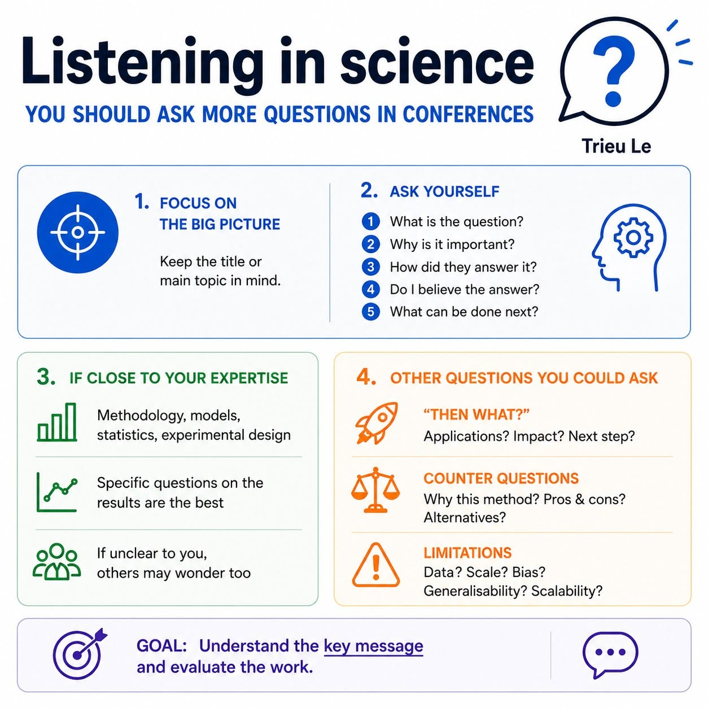

[← Back to Thoughts](index.qmd)

If you ever feel like you have a hard time following talks in meetings or conferences, want to contribute more to discussions, but feel like you don’t have any “good” or “smart” questions to ask, you are not alone. Sometimes you may even feel lost in the middle of a talk despite trying your best to focus. I have been there many times, and I have always wondered how to improve that situation.

After years in academia, including my Master's and PhD, I have observed senior scientists being very comfortable during talks. They often ask great and highly relevant questions, even when the topic is not exactly within their expertise. I wanted to be able to do that too. I asked for advice from a few people, but most of the answers felt more like natural responses or behaviours: "just keep trying," "read more," "ask any questions if you don't understand." Those are fairly good suggestions, but I wanted something more practical. I wanted to ask relevant questions and feel like part of the discussion.

People often talk about presentation skills, but not much about listening skills in science. I think both are equally important. Over time, I developed my own simple framework of questions (or tips) that helps me engage with talks more comfortably and understand them better without trying too hard to catch every detail on every slide.

# 🎯 Keep the title or main topic in mind
I cannot tell you how important this is. I also cannot tell you how many times I struggled to follow a talk simply because I missed the first slide. Once you know the main topic, you can allow yourself to skip some minor details, especially if they are distant from your expertise.

# 🧠 Be more active while listening
It can massively improve your understanding of the talk. Keep asking yourself these questions:
1. What is the question?
2. Why is it important?
3. How did they answer it?
4. Do I believe the answer?
5. What can be done next?

# 🔬 Things you could ask if the topic is close to your expertise
Questions about methodology, models, statistics, or experimental design are always valuable. These are often the foundation of the work and should be discussed thoroughly. They should also be presented clearly by the speaker. If something is unclear, chances are other people are wondering the same thing.
And of course, specific questions about the results are usually the best questions. They show that you have been actively listening and thinking critically about the science.

# 🚀 Other questions you could ask
- "Then what?" questions: What are the applications? If successful, what impact could this work have on the field or the wider world?
- ⚖️ Counter questions: Why did they choose this method? What are the advantages and disadvantages? How does it compare with alternative approaches that may be cheaper, less invasive, faster, or more robust?
- ⚠️ Limitations: What are the limitations of the study? Are there concerns about sample size, dataset selection, generalisability, or scalability?

# 💬 Universal questions
These work for almost any talk, but I personally do not recommend them. They should only be used when there are no other questions and you want to help the speaker further explain their work.
- What surprised you most during this project?
- What was the biggest challenge you faced?
- What result would have changed your conclusion?
- What question are you most excited to answer next?

# 🏆 After the talk
Just go through these questions. If you feel like you can at least partially answer them yourself, congratulations—you have understood the talk and learned something new.
These questions may seem simple, but they get straight to the heart of the science; not every speaker can answer them clearly. Asking them creates opportunities for useful discussion and clarification.
And remember, the goal is NOT to understand every slide. The goal is to understand the key message and evaluate the work.

# 📢 One final thought
Based on my own experience and many people I know, I feel that some Vietnamese people (and perhaps Asians in general) are often a bit more hesitant to speak up in public. It could be language barriers, cultural factors, fear of being judged, or a combination of many things. I used to be like that too.
So, I would really encourage fellow early-career researchers and scientists to SPEAK UP. Your question does not have to be perfect. It only needs to be genuine.
This is by no means a solid protocol, and it is probably quite personal. But it has helped me a lot. If you read this far, I hope it might be useful to you as well in your next meeting or conference.

{fig-align="center" width="90%"}

[← Back to Thoughts](index.qmd)
