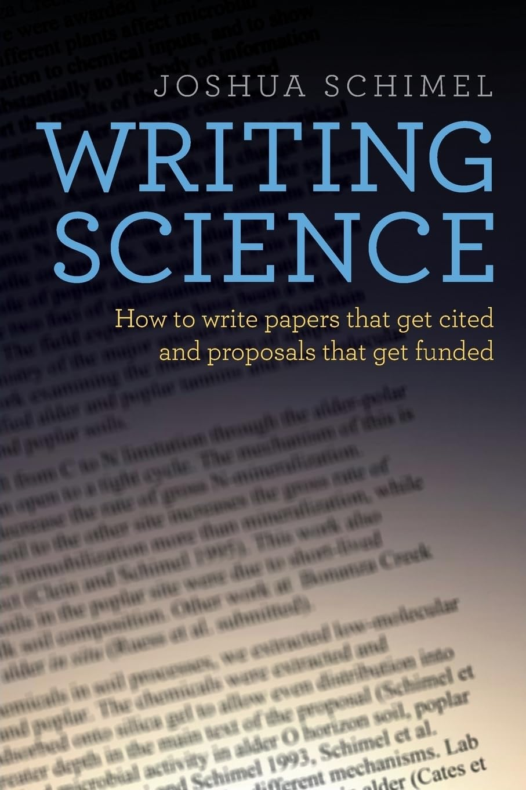

[← Back to Thoughts](index.qmd)

I am not in a position to tell anyone how to write or what the best way is. I am an apprentice in writing, and I am still learning myself. But I have finished my Bachelor's thesis, my MPhil thesis, and I have written several reports and papers during my PhD journey. Along the way, I have learned a few things about writing, and I want to share them here.

Let's start with what I find most challenging when I talk to people about writing: **getting started**.

Why is it so hard to start?

People often wait for the right moment, the right time, the right mood, or the right inspiration. But the truth is, there is no right moment. And even when they have started, many struggle with the first sentence or paragraph. They want to write the best paragraph right from the beginning.

I totally understand that.

As English is not my first language, getting started is even more challenging. I have spent hours, sometimes days, thinking about the first sentence. I have written and rewritten the first paragraph many times before moving on.

But I have learned that it is not important to write the best paragraph at the beginning. It is more important to have something on the page.

Your first draft will not be your final draft. At least in scientific writing, almost nothing is submitted exactly as it was first written. You revise it yourself, send it to your supervisors or colleagues, receive feedback, revise it again, and probably repeat the process several times.

So why expect the first draft to be perfect?

You can always improve something that has been written. You cannot improve a blank page.

## Start with an outline

One thing that helps me overcome this is having a strong outline.

Before writing, discuss the structure with your supervisors or colleagues. Once you are happy with the overall outline, make it more detailed. Then make it even more detailed—to the point where you know roughly what you want to say in each section.

For example, instead of starting with:

> **Discussion**

break it down into:

> **Discussion**  
> - What is the main finding?  
> - How does it compare with previous studies?  
> - What could explain the finding?  
> - What are the limitations?  
> - Why does it matter?

At that point, you are no longer facing an empty page and wondering, *What should I write?* You already know what you want to say.

Then, just start writing.

In my first draft, I don't even care too much about grammar, spelling, or punctuation. I just try to put my ideas into words. I know I can come back and revise them later.

For me, separating **writing** from **editing** makes starting much easier.

## A book that changed how I think about writing

One of the books that has truly inspired me is *Writing Science* by Joshua Schimel.

I highly recommend it to anyone who wants to improve their scientific writing. It teaches not only how to write clearly and concisely, but also how to think about scientific writing as storytelling—how to build an argument, guide the reader, and communicate why your science matters.

Many of the ideas in the book have become embedded in the way I think about writing.

One sentence from the beginning of the book has particularly stayed with me:

> "As a scientist, you are a professional writer."

{fig-align="center" width="40%"}

That sentence changed my perspective. Writing is not something separate from doing science. Papers, reports, grants, theses, presentations—our ability to communicate our work is part of being a scientist.

I am still learning how to write, and I expect I always will be. But one lesson has already made writing much easier for me:

**Don't try to write the perfect first draft. Just start writing.**

[← Back to Thoughts](index.qmd)
