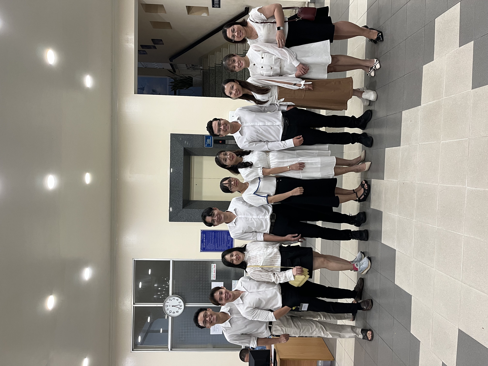
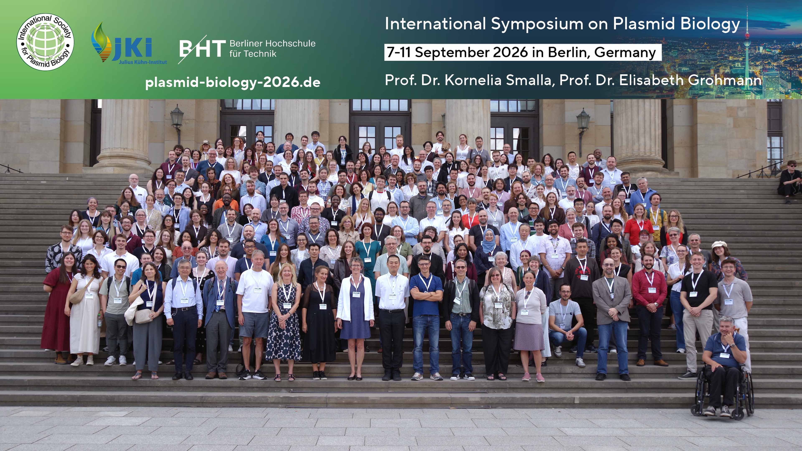

I'm Trieu.

**Lê Phạm Tiến Triều**

Research has taken me through different laboratories, universities, teams,
conferences, and countries. This page is a collection of some of the people,
places, and moments that have been part of that journey.

  
  
  
  
  
  
  
  
  

---

## 🇻🇳 OUCRU Vietnam

My early research journey in infectious diseases and genomics at the
Oxford University Clinical Research Unit (OUCRU) in Vietnam.

---

## 🔬 Josie Bryant's Team

Science is not only about experiments and data, but also about the people
we work with and learn from.

---

## 🎓 University of Cambridge

A year of learning genomics, bioinformatics, and computational biology,
and an important transition in my journey towards genomic research.

---

## 🧬 Wellcome Sanger Institute

Some memories from my time at the Wellcome Sanger Institute — a place
where I was surrounded by genomics, computational biology, and people
working at the forefront of genomic research.

---

## 🎓 University of Bath

The next chapter of the journey — my PhD.

My research focuses on bacterial genomics and evolution, particularly
the role of plasmids and other mobile genetic elements in the spread
of antimicrobial resistance.

---

## 🧬 Zamin Iqbal's Team

Research is rarely a solitary journey. I am fortunate to work with people
from whom I can learn about bacterial genomics, pangenomics, algorithms,
evolution, and much more.

---

## 🌍 Conferences

One of the parts of research I enjoy most is meeting people with different
ideas and perspectives.

Conferences have given me opportunities to present my work, discover new
research, discuss ideas, and meet researchers from around the world.

---

## 🔬 Visiting the Old Lab

Sometimes moving forward also means returning to where part of the journey
began.

---

## 🇻🇳 Vietsocs

Life beyond research matters too.

Community, friendships, shared experiences, and staying connected with
Vietnam have also been an important part of my life in the UK.

---

## Along the Way

Science is more than experiments, code, data, papers, and results.

It is also about the people we meet, the places we go, the ideas we encounter,
and the experiences that gradually shape how we think.

This page is a growing collection of those moments.

**More to come.**